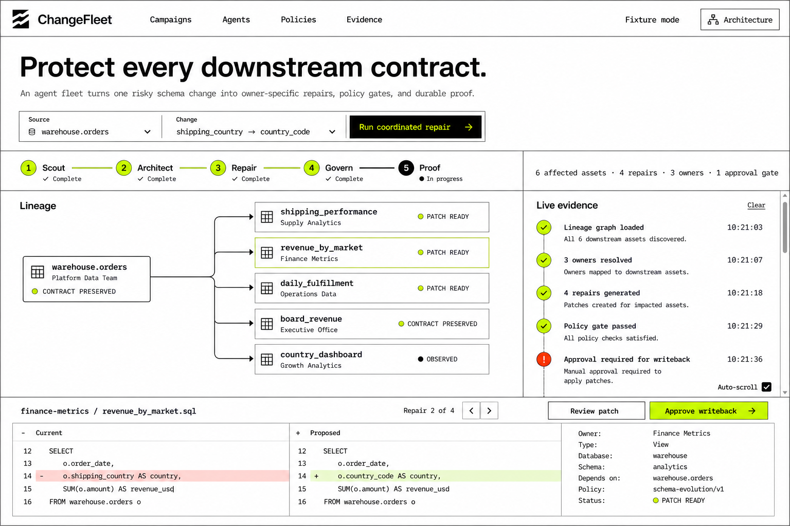
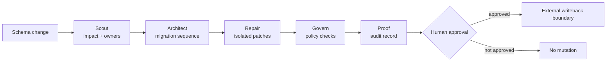

# ChangeFleet

**Protect every downstream contract.**

ChangeFleet is a policy-gated agent fleet for enterprise data changes. Given one risky schema mutation, five specialized agents discover the downstream blast radius, choose contract-safe migration strategies, draft owner-specific repairs, enforce mutation policy, and produce durable evidence.

The public demo is intentionally safe: it runs a deterministic fixture by default and never writes to an external repository. Live Gemini execution is available only when credentials are explicitly configured, and writeback remains behind a human approval boundary.



## Why it exists

A field rename in a warehouse table can break dbt models, scheduled queries, semantic views, dashboards, and executive metrics owned by different teams. Traditional code search finds strings; ChangeFleet models the change as a coordinated campaign with ownership, contracts, policy, repairs, and proof.

## Agent workflow



- **Scout** uses bounded lineage and owner resolution tools.
- **Architect** applies contract-specific compatibility policy.
- **Repair** drafts exact file changes without claiming external writes.
- **Govern** checks scope, contract preservation, and mutation authorization.
- **Proof** separates observed evidence from proposed action.

The live graph is implemented with Google Agent Development Kit `Workflow` and Gemini 3.5 Flash. The fixture engine mirrors the same five stages so reviewers can inspect the full product without credentials.

## Run locally

Prerequisites: Python 3.12+ and Node.js 24+.

```bash
python -m venv .venv
# Windows: .venv\Scripts\activate
# macOS/Linux: source .venv/bin/activate
pip install -r backend/requirements-dev.txt

cd frontend
npm ci
npm run build
cd ..

# Windows PowerShell
$env:PYTHONPATH="backend"
python -m uvicorn backend.app.main:app --host 127.0.0.1 --port 8080
```

Open `http://127.0.0.1:8080`. API documentation is available at `/docs`.

Run verification:

```bash
pytest backend/tests -q
cd frontend && npm run build
```

## Enable live Gemini

Copy `.env.example` values into your environment and choose one supported path:

1. Set `GOOGLE_API_KEY`, or
2. Set `GOOGLE_GENAI_USE_VERTEXAI=true`, `GOOGLE_CLOUD_PROJECT`, and `GOOGLE_CLOUD_LOCATION` with Application Default Credentials.

Then call:

```bash
curl -X POST http://127.0.0.1:8080/api/adk/run \
  -H "Content-Type: application/json" \
  -d '{"prompt":"Coordinate CF-204 and return an evidence-grounded plan."}'
```

Without credentials the endpoint fails closed with `503`; it does not fake a model response.

## Deploy to Cloud Run

The repository includes a multi-stage `Dockerfile` that builds the React client and serves it from FastAPI.

```bash
gcloud auth application-default login
gcloud config set project YOUR_PROJECT_ID
gcloud run deploy changefleet \
  --source . \
  --region us-central1 \
  --allow-unauthenticated \
  --set-env-vars GOOGLE_GENAI_USE_VERTEXAI=true,GOOGLE_CLOUD_PROJECT=YOUR_PROJECT_ID,GOOGLE_CLOUD_LOCATION=us-central1,CHANGEFLEET_MODEL=gemini-3.5-flash
```

For a public contest demo, keep credentials server-side and grant the Cloud Run service account only the minimum Vertex AI permission required. No external writeback integration is enabled in this version.

## API surface

| Endpoint | Purpose |
| --- | --- |
| `GET /api/health` | Runtime mode, model, and agent count |
| `GET /api/scenario` | Inspect the checked-in evidence fixture |
| `GET /api/architecture` | Inspect stages, tools, and mutation boundary |
| `POST /api/campaigns` | Run the deterministic campaign |
| `POST /api/campaigns/{id}/approve` | Record local human approval; applies no external write |
| `POST /api/adk/run` | Run the live Google ADK workflow when configured |

## Project status

ChangeFleet began as a new project during the 2026 All Things Agentic Hackathon period. It has no claimed customers, production deployments, or external repository mutations. The fixture scenario and repair output are synthetic and clearly marked. See [the Devpost submission draft](docs/devpost-submission.md) and [commercial pilot outline](docs/pilot-offer.md) for the next milestones.

## License

Apache-2.0
